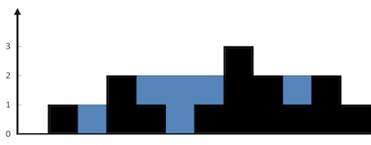

# [42. Trapping Rain Water](https://leetcode.com/problems/trapping-rain-water)

<!-- tags:Stack,Array,Two Pointers,Dynamic Programming,Monotonic Stack -->

## Description

<p>Given <code>n</code> non-negative integers representing an elevation map where the width of each bar is <code>1</code>, compute how much water it can trap after raining.</p>

<p>&nbsp;</p>
<p><strong class="example">Example 1:</strong></p>

<pre>
<strong>Input:</strong> height = [0,1,0,2,1,0,1,3,2,1,2,1]
<strong>Output:</strong> 6
<strong>Explanation:</strong> The above elevation map (black section) is represented by array [0,1,0,2,1,0,1,3,2,1,2,1]. In this case, 6 units of rain water (blue section) are being trapped.
</pre>

<p><strong class="example">Example 2:</strong></p>

<pre>
<strong>Input:</strong> height = [4,2,0,3,2,5]
<strong>Output:</strong> 9
</pre>

<p>&nbsp;</p>
<p><strong>Constraints:</strong></p>

<ul>
	<li><code>n == height.length</code></li>
	<li><code>1 &lt;= n &lt;= 2 * 10<sup>4</sup></code></li>
	<li><code>0 &lt;= height[i] &lt;= 10<sup>5</sup></code></li>
</ul>

## Solutions

### Solution 1: O(n) space

<!-- tabs:start -->

```python
class Solution:
    def trap(self, height: List[int]) -> int:
        maxLeft = [0] * len(height)
        maxRight = [0] * len(height)
        output = [0] * len(height)
        left, right = 0,0

        maxLeft[0] = left
        maxRight[len(height)-1] = right

        for i in range(1,len(height)):
            left = max(left, height[i - 1])
            maxLeft[i] = left

        for i in range(len(height)-2, -1, -1):
            right = max(right, height[i+1])
            maxRight[i] = right

        sum = 0
        for i in range(len(maxLeft)):
            temp = 0
            output[i] = min(maxLeft[i], maxRight[i])
            temp = output[i] - height[i]
            if temp < 0:
                temp = 0
            sum += temp

        return sum
```

<!-- tabs:end -->

### Solution 2: O(1) space

<!-- tabs: start -->

```python
class Solution:
    def trap(self, height: List[int]) -> int:
        maxLeft = [0] * len(height)
        maxRight = [0] * len(height)
        output = [0] * len(height)
        left, right = 0,0

        maxLeft[0] = left
        maxRight[len(height)-1] = right

        for i in range(1,len(height)):
            left = max(left, height[i - 1])
            maxLeft[i] = left

        for i in range(len(height)-2, -1, -1):
            right = max(right, height[i+1])
            maxRight[i] = right

        sum = 0
        for i in range(len(maxLeft)):
            temp = 0
            output[i] = min(maxLeft[i], maxRight[i])
            temp = output[i] - height[i]
            if temp < 0:
                temp = 0
            sum += temp

        return sum
```

<!-- tabs:end -->

<!-- end -->
